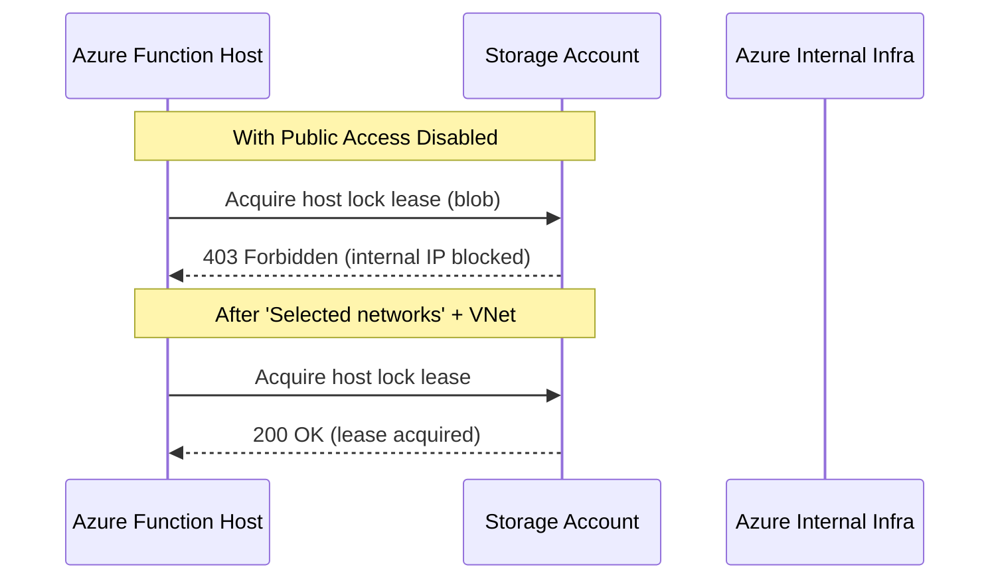
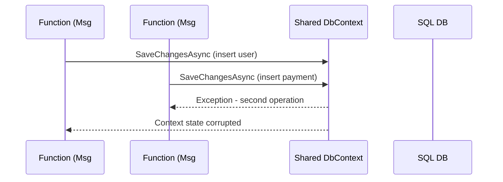

We recently lifted an old .NET Framework + Entity Framework 6 codebase into an Azure Functions v1 app that listens to Service Bus messages and writes to SQL Server.

On paper, the flow is straightforward:
- New booking → Service Bus topic  
- Azure Function picks up the message  
- We map it, update user/profile/payment tables via EF, and emit telemetry to Application Insights  

In reality, we hit two very different issues that kept showing up in production:
1. Host lock lease failures on the Function host  
2. Entity Framework “A second operation started on this context…” errors under load  

To make it more confusing, these two errors often showed up a day or two after a restart, so for a while we were convinced the host lock problem was causing the EF exceptions.

This post walks through the symptoms, false leads, the actual root causes, and the fixes.

---

## Architecture at a Glance

```mermaid
flowchart LR
    A[External System] -->|Booking Message| B[Azure Service Bus Topic]
    B --> C[Azure Function App (v1, .NET Framework)]
    C -->|Host locks, logs| D[Storage Account (AzureWebJobsStorage)]
    C -->|EF6 / ADO.NET| E[SQL Database]
    C -->|Telemetry| F[Application Insights]
```

---

# Issue 1 – “Failed to acquire host lock lease (403 Forbidden)”

## Symptoms

Every now and then we’d see the function app go into a bad state. In the Log stream, the host spammed messages like:

```
[Verbose] Host 'xxxx' failed to acquire host lock lease:
Microsoft.WindowsAzure.Storage: The remote server returned an error: (403) Forbidden.
Forbidden.
Forbidden.
```

Restarting the Function App “fixed” it for a while. After 24–48 hours, the same pattern returned.

At the same time, we were tightening security on the storage account:
- Public network access disabled  
- Only private endpoints / VNet access  

Our app settings, connection strings, and keys were all correct. We’d also wired up managed identity and blob data contributor roles. Yet the host could not acquire the lease blob in `azure-webjobs-hosts/locks`.

---

## Why does the host need a blob lease?

Azure Functions uses a host lock (blob lease) in the storage account to coordinate:

- Which host instance is “active” for timers/triggers  
- Scale controller coordination  
- Internal runtime housekeeping  

If the runtime can’t read/write that blob, it can’t safely start processing, and you’ll see the “failed to acquire host lock lease” messages.

---

## The trap: we thought this was causing everything

Because the error only showed up after some time and restarting fixed things, it was tempting to say:

> “Okay, the host can’t acquire the lock → that must be why EF is throwing errors too.”

So we got into a habit of restarting the function during off-hours as a band-aid. That bought us time but wasn’t a real fix.

---

## The real culprit: storage network rules + internal Azure IPs

During a detailed session with Microsoft support, we learned:

- Azure Functions uses internal Azure IPs to access the storage account.  
- Setting **Public network access = Disabled** blocks some of those internal calls.  
- Adding your VNet to “Selected networks” implicitly allows Azure internal infra paths.  

### The fix

We changed the storage networking mode to **Selected networks** and explicitly allowed the Function App VNet.

After this:

- Host lock lease errors disappeared  
- No more “unhealthy after a day” behaviour  
- No more manual restarts  

---

## Diagram: what actually happens



---

# Issue 2 – EF6 + Azure Functions = “A second operation started on this context…”

Once the host lock issue was fixed, the EF problem still persisted.

## The EF error

```
A second operation started on this context before a previous asynchronous operation completed.
Use 'await' to ensure that any asynchronous operations have completed before calling another method on this context.
Any instance members are not guaranteed to be thread safe.
```

Inner exception showed foreign key conflicts due to inconsistent state.

Restarting the function cleared it temporarily, misleading us into thinking both issues were connected.

---

## Root cause: one static DbContext shared across everything

Legacy code created **one static DbContext** shared across all messages & executions.

This led to:

- Parallel operations corrupting EF change tracking  
- “Second operation on this context” exceptions  
- Rare FK conflicts  

EF6 DbContext is **not thread-safe**. No amount of async/await fixes that.

---

## Concurrency diagram



---

## The fix – one DbContext per message, properly disposed

### 1. Container returns a fresh DbContext per call  
### 2. BookingServicebusFunc implements IDisposable  
### 3. Function creates and disposes context with `using`  
### 4. Added EF clean-ups such as AsNoTracking  

After the change:

- No more concurrency errors  
- No more FK conflicts  
- No more restart hacks  

---

# Putting both issues side by side

```mermaid
flowchart TB
    subgraph Issue1[Issue #1: Host Lock / Storage Networking]
      I1A[Public network access disabled] --> I1B[Internal Azure IPs blocked]
      I1B --> I1C[403 on host lock lease]
      I1C --> I1D[Host unhealthy after a day]
      I1D --> I1E[Manual restart "fixes" temporarily]
    end

    subgraph Issue2[Issue #2: EF Concurrency]
      I2A[Static shared DbContext] --> I2B[Parallel message processing]
      I2B --> I2C[Second operation on same context]
      I2C --> I2D[FK conflicts & partial writes]
      I2D --> I2E[Manual restart resets context]
    end
```

---

# Lessons we’re taking forward

### 1. Storage networking matters  
- Prefer **Selected networks** over hard disabling public access.  
- Azure Functions runtime itself needs access paths to storage.  

### 2. DbContext is a unit of work  
- Never treat EF6 DbContext as a singleton.  
- Create one per message and dispose it.  

### 3. Beware restart-driven debugging  
- If restarts fix something temporarily, you probably have:
  - a lifetime leak, or  
  - a platform/network configuration issue.  

---


